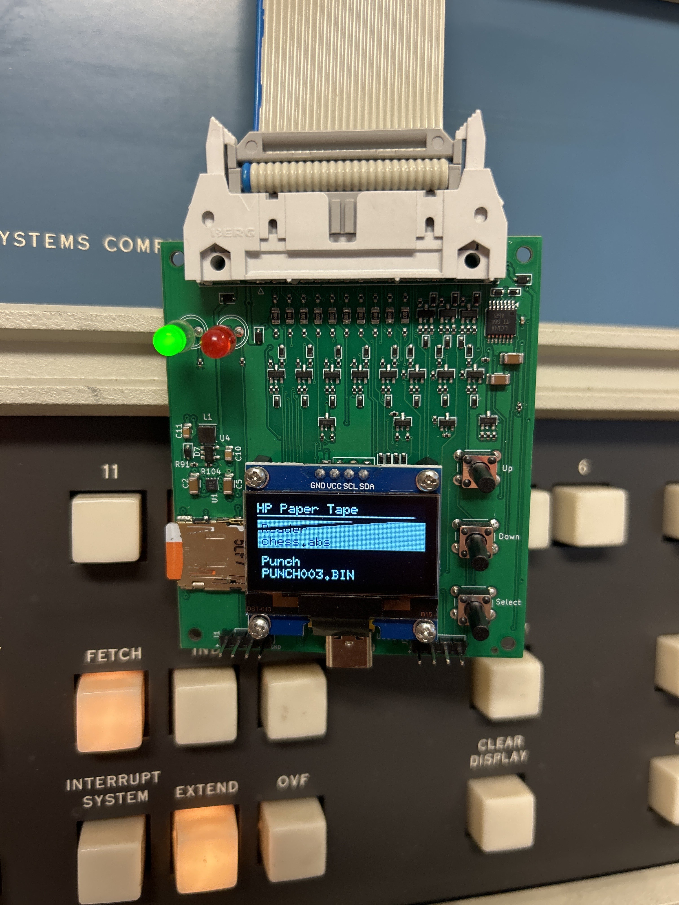
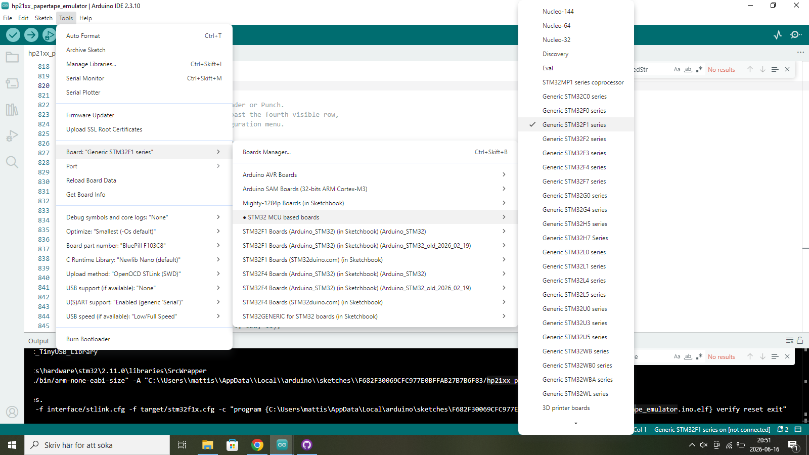

# HP 21XX Paper Tape Emulator

The idea to this project come from this page: [newton.freehostia.com/hp](https://newton.freehostia.com/hp/). A simple PIC processor connected to the ubiquitous HP 12566 Microcircuit boards that provide 16 bits of general input and output with a simple handshake. The software interface is identical to the one used for the paper tape reader and paper tape punch. The interface originally used for punch and reader, 12597A is a +12V level interface which made them a bit harder to interface. The 12566A board which used just standard +5V signals was easier to work with and I had plenty of them.

So I thought I should make my own, but then I thought, why involve a PC. I could store the files I wished to download on a small SD-card and have a small display and a couple of buttons to interact with to select what file I wanted to download into the machine! And then there was this idea, why not make it work as a punch as well so that I can take the output from the HP computer and store it on a file that subsequently can be uploaded. Useful if one would try compiling some small program on it.

## Progress

Now I am able to both read files into the computer and punch from the computer. Here is a quick video showing when a Chess program is loaded into my HP 2100S.

Loading of the 72 k abolute binary files takes place when the red LED light up for a few seconds. It fills up the entire 32k Word memory space of the HP 2100.

This is how the finished board came to look like. Three buttons, Up, Down and Select, and small 128x64 OLED panel to configure and control it. A Micro SD card for file storage and USB-C connector that can be used to power the device unless powered over the 26 pin ribbin connector. The green LED indicate power and the red LED indicate activity.

The UI is rather simple. Simply navigating up and down and press the select button. The main menu have two menu items, one to select the reader file and one select the punch file. Pressing select will get you to a file selct menu where the currently selected file is shown and where you can navigate to the file you want to select. Pressing select also exits back to the main menu. On the punch menu there are also an option to create a new file with a sequence number. If an existing file is selected it will append to that file.

Since there are only three buttons the UI also have special actions when pressing a button more than 4 seconds. A long press on the select menu brings up the configuration menu. In here you can set if signals are active high or active low. For 12566A and 12566B there are two board revsions which get you to choose from active high (POS TRUE) or active low (GND TRUE) data. The active high or low for hand shake signals are configurable on both these cards. The 12566C has all parameters configurable. You should check yoour board so that it matches the config you set in this menu. There is also an option to configure 12V signals or 5V signals. 5V is used for 12566 boards while 12V is used for 12597 boards. You cannot mix a 12566 board and a 12566 board and connect them simultaneously to the paper tape emulator. There are also certain variants of the 12597 board that have -12V signals. This type of board is not supported. Unless you convert the board to +12V.

If you long press on the Down button when in the main menu the currently selected file will be rewound to the beginning so that it can be read again.

If you long press on the Up button the USB MSC mode will be stated and all emulation is stopped. This will allow you to browse the contents from a host computer if the emulator is connected over USB-C. This feature is now active. The STM32F103 have a very small memory and it will take a while for the MCU to transfer big amounts to the host. Unfortunately it seems like at least Windows 10 wants to read about 16000 blocks from the disk when it is mounted. This takes quite some time and will ead to that the drive is not showing up active in the computer. Probably because the file system is 8Gb. I think that by making the partition smaller it will read less from the disk when moounting it. A 32 Meg partition will easily hold all the paper tapes you ever will use on a HP21xx machine.

## BOM

For all the surface mount components the BOM is among the production files in the kicad folder. Other than that the following hardware is needed to complete the emulator:

* [Screws  M2 5mm.  8 pcs](https://www.aliexpress.com/item/32768907028.html)
* [Nylon hex standoffs for the display are 6mm M2. 4 pcs](https://www.aliexpress.com/item/1005003577479911.html)
* [Nylon washers M2 5mm x 1mm high: 8 pcs.](https://www.aliexpress.com/item/1005008318320472.html)
* [Display is a OLED 128x64 with I2C Using SH1106 chip.](https://www.aliexpress.com/item/1005007451015054.html)
* [Buttons are 6x6 mm 13 mm high tactile buttons](https://www.aliexpress.com/item/1005002487399422.html)
* [Connector is Ampehnol FCI 71922-126LF](https://www.mouser.se/ProductDetail/649-71922-126LF)
* Red 5 mm LED
* Green 5 mm LED
* 4 pin header 2.54 mm for SWD and serial debugging port. 2 pcs.

## Connecting it to the HP machine 

The connector for the HP computer is a 48 pin 0.156 inch (3.96 mm) connector. EDAC and Sullins manufacture these.

I used a 26 pin ribbon connector in the emulator end and splitted that one in two 13 conductor halves going to one each 48 pin connector.

### Mods to supply 5V to the emulator

A good idea is to modify the 12566 and 12597 boards to supply 5V to the emulator. There are schottky diodes on the supply line internally on the emulator to avoid backpowering things so it should be safe to connect the punch and reader to different computers and also safe to have a PC connected to the USB simultaneously.

I modifed my 12566 boards to supply 5V on pin 20 since it is unused also on the 12597 boards this pin is unused.

### Reader
|Pin on 26 pin connector | Designator on the 26 pin connector | Pin on 48 pin connector for the 12566 board |HP designator on 12566 board | Pin on the 48 pin connector for the 12597 board | HP designator on 12597 board |
|----|-----|-----|----|----|----|
| 14 | NC  | NA  | NA |    |    |
| 15 | INCR | 22 |  DEVICE COMMAND  | AA  | Read |
| 16 | OUTFR | 23 | DEVICE FLAG | 23 | Feed Hole |
| 17 | OUT7 | 8  | Bit 7 | 8 | Bit 7 | 
| 18 | OUT6 | 7  | Bit 6 | 7 | Bit 6 |
| 19 | OUT5 | 6  | Bit 5 | 6 | Bit 5 | 
| 20 | OUT4 | 5  | Bit 4 | 5 | Bit 4 |
| 21 | OUT3 | 4  | Bit 3 | 4 | Bit 3 |
| 22 | OUT2 | 3  | Bit 2 | 3 | Bit 2 |
| 23 | OUT1 | 2  | Bit 1 | 2 | Bit 1 |
| 24 | OUT0 | 1  | Bit 0 | 1 | Bit 0 |
| 25 | GND  | 24 | Ground | 24 | Ground |
| 26 | +5V  | 20 | | 20 |  |

### Punch

|Pin on 26 pin connector | Designator on the 26 pin connector | Pin on 48 pin connector for the 12566 board | HP designator on 12566 board |Pin on the 48 pin connector for the 12597 board | HP designator on 12597 board| 
|----|-----|-----|----|----|----|
| 1  | +5V | 20  | | 20 |  |
| 2  | GND | 24  | GROUND | 24 | Ground |
| 3  | INCP | 22  | DEVICE COMMAND   | AA | Punch |
| 4  | OUTFP| 23 | DEVICE FLAG | 23 | Flag |
| 5  | IN0  | A  | BIT 0 | A  | Bit 0 |
| 6  | IN1  | B  | BIT 1 | B  | Bit 1 |
| 7  | IN2  | C  | BIT 2 | C  | Bit 2|
| 8  | IN3  | D  | BIT 3 | D  | Bit 3 |
| 9  | IN4  | E  | BIT 4 | E  | Bit 4 |
| 10  | IN5  | F  | BIT 5 | F | Bit 5 |
| 11 | IN6  | H  | BIT 6 | H  | Bit 6 |
| 12 | IN7 | J | BIT 7 | J | Bit 7 |
| 13 | PAPER_LOW | 6 | BIT 5 | 6 | Low Tape|

## Firmware

The firmware is built using the Arduino framework. <strike>I have been using the Maple based core adapted by Roger Clark: [Arduino_STM32](https://github.com/rogerclarkmelbourne/arduino_stm32). Follow the instructins and install this in your Arduino Environment.
In addition to that I have replaced the standard SDfat V2 library with a SDfat library that works with this core, [SDFat library by VictorPV](https://github.com/victorpv/SdFat), but still support long file names.

Then it is important to select this core under tools. Also select the correct target, STM32F103C8.</strike>

I now converted into using the standard core for STM32 on Arduino. The TinyUSB library has to be installed. In addition to that I downloaded and installed [TinyUSB-Arduino-STM32](https://github.com/code-fiasco/TinyUSB-Arduino-STM32?utm_source=chatgpt.com) for STM32 support. Please follow instructions in the repo.

The picture above indicate the config needed. STM32F103 Bluepill. Please adapt dependning on download method. In the binaries folder there is a new binary that can be used directly.

Uploading takes place over SWD so a STM32 SWD dongle is required. Unfortunately there are no jumpers available on the board to allow download over the serial port. It can be patched. The BOOT0 pin is pulled down with a 10k resistor to ground but can be tied to +3.3V to achieve a high input. BOOT1/PB2 is currently in use as an output, PUSEL, which alread has a pull down to ground already. Jumpering BOOT0 like this would then allow to enter serial boot mode after reset. There is also no reset button so either a power cycle is required or attach an external button to the RESET input of the processor. Future version might add a BOOT0 jumper.

A new layout has been comitted to the repo that adds a jumper that allow setting BOOT0 high. Along with BOOT1 pulled low this will then let the MCU enter serial download mode.

Software to upload code via serial port is for example [stm32flash](https://github.com/FYSETC/stm32flash)

I have not tried serial boot mode myself so I cannot tell how to work with it. I always use the STM32 SWD dongle.

## Documentation

Here are some links to relevant HP document for the 12597 and 12566 boards:

* [12566B Micro circuit interface manual](https://bitsavers.org/pdf/hp/21xx/interfaces/12566.pdf)
* [12597A-002 Reader interface manual](https://www.bitsavers.org/pdf/hp/21xx/interfaces/12597A-002.pdf)
* [12597A-005 Punch interface manual](https://www.bitsavers.org/pdf/hp/21xx/interfaces/12597A-005.pdf)

